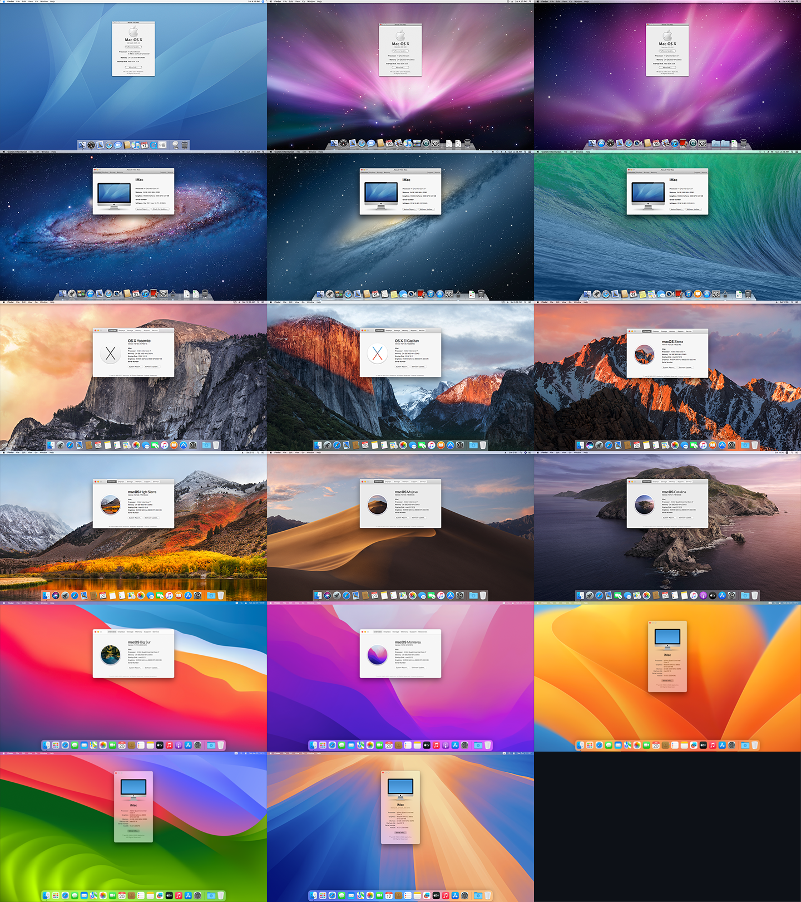
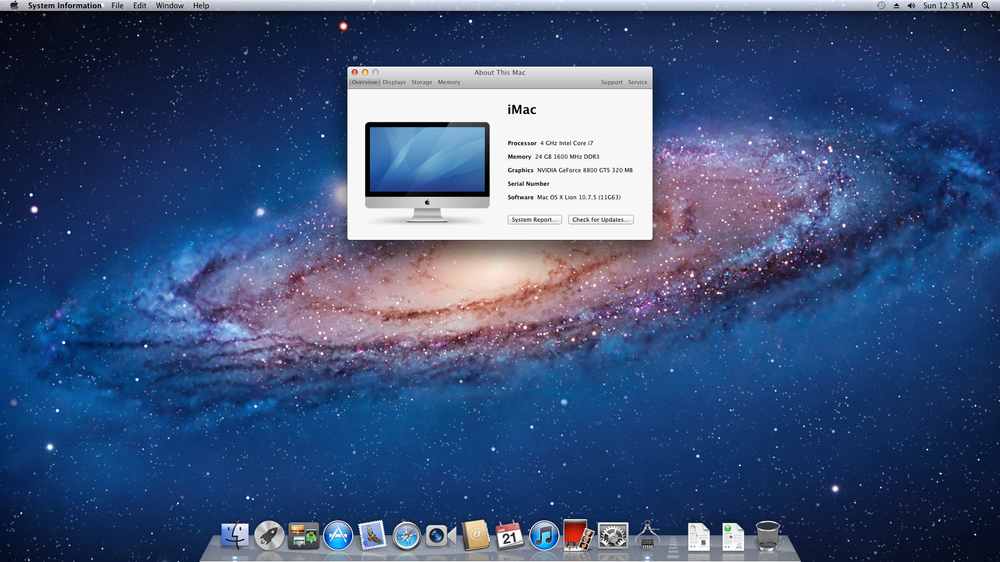
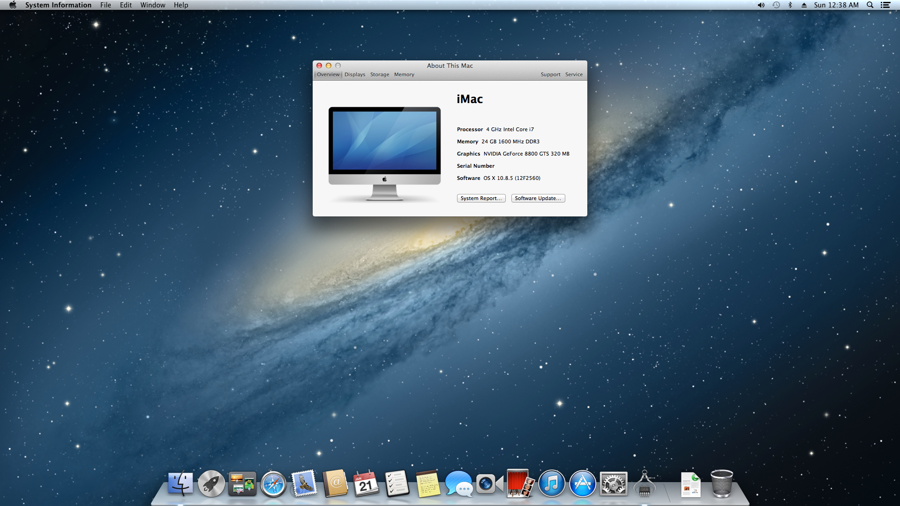
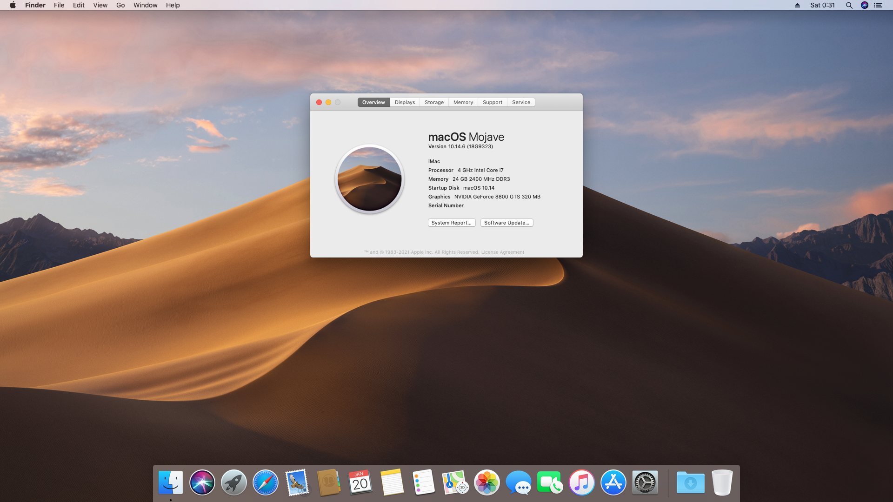

# MSI Z97M Hackintosh runs every macOS
Hackintosh EFI and guide repo for running every Intel macOS versions from Tiger (10.4) to Sequoia (15)

## Features
* Single hardware configuration - No need to swap cards like GPU depending on macOS version
* Single connector configuration - No need to switch HDMI, LAN, and USB to different connectors depending on macOS version
* Single BIOS configuration - No need to change any BIOS settings depending on macOS version
* Single bootloader - No need to use Clover / Chameleon for older macOS, OpenCore covers all
* Single config.plist - No need to switch multiple config.plist, single plist covers all

## Contents
* How to build ( [en](./docs/build_en.md) / [ja](./docs/build_ja.md) )
* Install guide ( [en](./docs/install_en.md) / [ja](./docs/install_ja.md) )

## Hardware
|               |Model                        ||
|---------------|-----------------------------|-|
|Motherboard    |MSI Z97M Gaming              ||
|CPU            |Intel Core i7-4790K (Haswell)||
|GPU            |NVIDIA GeForce 8800 GTS (G80)|320MB|
|Memory         |DDR3-2400 XMP 8x2+4x2        |24GB|
|Sound (Onboard)|Realtek ALC1150              ||
|NIC (Onboard)  |Atheros Killer E2205         |1Gbps|
|NIC (PCIe)     |Marvell Yukon 88E8053        |1Gbps|
|SSD (NVMe)     |WD SN500                     |500GB, with PCIe adapter|
|SSD (PCIe AHCI)|Samsung XP941                |256GB|
|SSD (SATA)     |OCZ Vertex 4                 |128GB|
|Bluetooth (USB)|DBT-120                      ||

## Software
### macOS
* macOS Sequoia 15.0.1 (24A348)
* macOS Sonoma 14.7 (23H124)
* macOS Ventura 13.7 (22H123)
* macOS Monterey 12.7.6 (21H1320)
* macOS Big Sur 11.7.10(20G1427)
* macOS Catalina 10.15.7 (19H2026)
* macOS Mojave 10.14.6 (18G9323)
* macOS High Sierra 10.13.6 (17G14042)
* macOS Sierra 10.12.6 (16G2136)
* OS X El Capitan 10.11.6 (15G22010)
* OS X Yosemtie 10.10.5 (14F2511)
* OS X Mavericks 10.9.5 (13F1911)
* OS X Mountain Lion 10.8.5 (12F22560)
* Mac OS X Lion 10.7.5 (11G63)
* Mac OS X Snow Leopard 10.6.8 (10K549)
* Mac OS X Leopard 10.5.8 (9L31a)
* Mac OS X Tiger 10.4.11 (8S2167)

### Bootloader and patchers
* [OpenCore](https://github.com/acidanthera/OpenCorePkg) 1.0.2
* [OpenCore Legacy Patcher](https://github.com/dortania/OpenCore-Legacy-Patcher) 2.0.2
* [macOS Catalina Patcher](http://dosdude1.com/catalina/) 1.4.7
* [macOS Mojave Patcher](http://dosdude1.com/mojave/) 1.3.7

### BIOS
* [1.9](https://www.msi.com/Motherboard/Z97M-GAMING/support) with [Samsung M.2 AHCI mod](https://winraid.level1techs.com/t/guide-how-to-get-m-2-pcie-connected-samsung-ahci-ssds-bootable/31221)

## Known issue
* Lion (10.7)
  * 32bit boot not working
* Tiger (10.4)
  * must unplug display cable while booting
  * non-vanilla custom kernel required

## Screenshots

